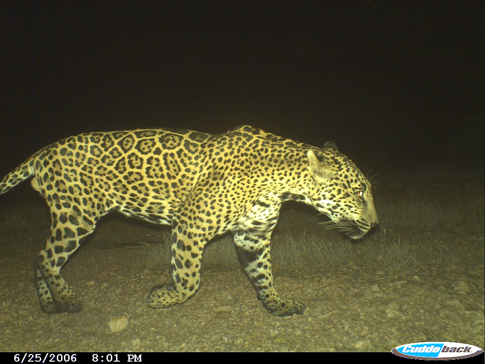

=====================================
Torch Traps :leopard: :camera_flash:
=====================================

.. image:: https://img.shields.io/pypi/v/torchtraps.svg
        :target: https://pypi.python.org/pypi/torchtraps

.. image:: https://img.shields.io/travis/winzurk/torchtraps.svg
        :target: https://travis-ci.com/winzurk/torchtraps

.. image:: https://readthedocs.org/projects/torchtraps/badge/?version=latest
        :target: https://torchtraps.readthedocs.io/en/latest/?badge=latest
        :alt: Documentation Status

Torch Traps is python package for lighting :zap: fast wildlife camera trap image annotation based on PyTorch. :fire:

Photo Credit: Northern Jaguar Project

Over the past several decades, biologists all over the world have widely adopted camera traps as a standard tool for
monitoring biodiversity, resulting in backlogs often on the order of millions of images waiting to be manually reviewed
by humans to assess wildlife population densities. The application of modern computer vision and deep learning methods
to accelerate the processing of wildlife camera trap data has the potential to alleviate existing bottlenecks for large
scale biodiversity monitoring, thus dramatically increasing the speed at which researchers can obtain data-driven
insights about ecosystems, and ultimately leading to more efficient resource allocation and better informed policy
making by NGOs and government agencies.

Torch Traps aims to provide a simple tool (as little as 1 line of code) to bring state-of-the-art computer vision models
into the hands of biologists to accelerate the speed at which they can review camera trap imagery.

* Documentation: https://torchtraps.readthedocs.io.

Install
--------
.. code-block:: bash

    $ pip install torchtraps

Fast Inference on Folder of Images
-------------------------------------------------

Classify an entire folder of camera trap images in one line of code by simply passing the relative path to the folder
containing images. Outputs are automatically saved to a csv file which can be further processed opened in an application
like Excel.

.. code-block:: python

    import torchtraps.lightning import kachow

    kachow('path/to/image/folder')

.. csv-table:: Example Output File
    :header: "image", "prediction", "confidence"

        "image1.jpg", "jaguar", 0.99
        "image2.jpg", "empty", 0.98
        "image3.jpg", "agouti", 0.91
        "image4.jpg", "empty", 0.95
        "image5.jpg", "ocelot", 0.87

Features
--------

* Module for fast computer vision on camera trap images.
* Train and fine-tune classification models on your own dataset.
* Based on PyTorch
* MIT license

